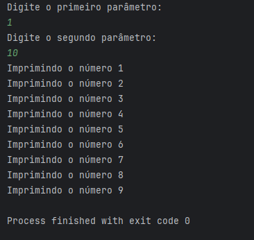

# 💻 Desafio Controle de Fluxo - Bootcamp Java DIO

Este projeto é a solução do desafio proposto no módulo de Controle de Fluxo do Bootcamp Java da DIO.

---

## 📋 Descrição do desafio

O sistema deve receber dois parâmetros inteiros via terminal que representarão dois números. Com esses dois números, o programa deve:

- Calcular a quantidade de interações entre eles (diferença entre o segundo e o primeiro parâmetro).
- Imprimir no console, em cada iteração, a mensagem:  
  `"Imprimindo o número X"`, onde X é o número da iteração.
- Caso o primeiro parâmetro seja maior que o segundo, deve lançar uma exceção customizada `ParametrosInvalidosException` com a mensagem:  
  `"O segundo parâmetro deve ser maior que o primeiro"`.

---

## 📷 Exemplo de Execução

---

## 📌 Regras de negócio implementadas
- Se o primeiro parâmetro for maior que o segundo, o programa lança a exceção `ParametrosInvalidosException`.

- O programa trata entradas inválidas (como letras ou símbolos), mostrando uma mensagem de erro clara.

- O programa verifica se os números são negativos, lançando a exceção `NumeroNegativoException` e exibindo mensagem adequada.

- Uso de tratamento de exceções para garantir que o programa não quebre e apresente mensagens amigáveis ao usuário.

## 🛠️ Estrutura do projeto
- **Contador.java** — classe principal contendo a lógica do programa.

- **ParametrosInvalidosException.java** — exceção customizada para validação dos parâmetros.

- **NumeroNegativoException.java** — exceção customizada para tratamento de números negativos.